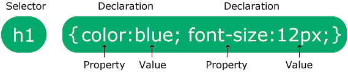

## ¿Qué es CSS?

CSS significa Hojas de Estilo en Cascada, describe cómo se deben mostrar los elementos HTML en la pantalla, en papel o en otros medios, ahorra mucho trabajo, Puede controlar el diseño de varias páginas web a la vez.
Las hojas de estilo externas se almacenan en archivos CSS.
CSS se utiliza para definir estilos para tus páginas web, incluyendo el diseño, la distribución y las variaciones en la visualización para diferentes dispositivos y tamaños de pantalla.

## CSS resolvió un gran problema.

¡El HTML NUNCA fue pensado para contener etiquetas de formato para una página web!

El HTML fue creado para describir el contenido de una página web, como:

`<h1>This is a heading</h1>`

`
This is a paragraph.
`

Cuando se agregaron etiquetas como `` y atributos de color a la especificación HTML 3.2, comenzó una pesadilla para los desarrolladores web. El desarrollo de grandes sitios web, donde la información de fuentes y colores se añadía a cada página, se convirtió en un proceso largo y costoso.

Para resolver este problema, el World Wide Web Consortium (W3C) creó CSS.

¡CSS eliminó el formato de estilo de la página HTML!

## Sintaxis de CSS

1. El selector apunta al elemento HTML que deseas estilizar.
2. El bloque de declaración contiene una o más declaraciones separadas por punto y coma.
3. Cada declaración incluye un nombre de propiedad CSS y un valor, separados por dos puntos.
4. Varias declaraciones CSS se separan con punto y coma, y los bloques de declaración están rodeados por llaves.

**Ejemplo:**

p{
    color:red;
    text-align: center;
}

## Selectores CSS

os selectores CSS se utilizan para "encontrar" (o seleccionar) los elementos HTML que usted quiero estilo.

Podemos dividir los selectores CSS en cinco categorías:

1. Selectores simples (seleccionar elementos basados en nombre, id, clase)
2. Selectores combinadores (seleccionar elementos basados en una relación específica entre ellos)
3. Selectores de pseudoclase (seleccione elementos basados en un determinado estado)
4. Selectores de pseudoelementos (seleccionar y diseñar una parte de un elemento)
5. Selectores de atributos (seleccionar elementos basados en un atributo o valor de atributo)

**Selectores de elementos CSS:**

El selector de elementos selecciona elementos HTML en función del nombre del elemento.

Ej: 

p{
    color:red;
    text-align: center;
}

**El Selector de identificación CSS:**

El selector de id utiliza el atributo id de un elemento HTML para seleccionar un elemento específico, el id de un elemento es único dentro de una página.

La regla CSS a continuación se aplicará al elemento HTML con id="para1": 

#para1 {
  text-align: center;
  color: red;
}

**El selector de clase CSS:**

El selector de clase selecciona elementos HTML con un atributo de clase específico.
Para seleccionar elementos con una clase específica, escriba un carácter de período (.), seguido de nombre de la clase.

**En este ejemplo, todos los elementos HTML con class="center" serán rojos y alineados en el centro:**

.center{
     text-align: center;
     color: red;
}

**En este ejemplo, solo los elementos `
` con class="center" serán rojo y alineado al centro:**

p.center {
  text-align: center;
  color: red;
}

**En este ejemplo, el elemento `
` se diseñará de acuerdo con class="center" y para class="large":**

`
This paragraph refers to two classes.
`

## El Selector Universal CSS

El selector universal (*) selecciona todo HTML elementos en la página.

Ej:

* {
text-align: center;
  color: blue;
}

## El Selector de Agrupación CSS

El selector de agrupación selecciona todos los elementos HTML con el mismo estilo definiciones, por ejemplo si tenemos este codigo CSS:

h1 {
  text-align: center;
  color: red;
}

h2 {
  text-align: center;
  color: red;
}

p {
  text-align: center;
  color: red;
}

Lo optimo seria agrupar los selectores con el fin de minimizar el codigo, se agrupa separando cada selector con una coma:

h1, h2, p {
  text-align: center;
  color: red;
}

## Todos los Selectores Simples CSS

| Selector           | Ejemplo          | Descripción                                                  |
|--------------------|------------------|--------------------------------------------------------------|
| `#id`              | `#firstname`     | Selecciona el elemento con id="firstname"                    |
| `.class`           | `.intro`         | Selecciona todos los elementos con class="intro"             |
| `element.class`    | `p.intro`        | Selecciona solo los elementos `
` con class="intro"        |
| `*`                | `*`              | Selecciona todos los elementos                               |
| `element`          | `p`              | Selecciona todos los elementos `
`                         |
| `element,element,..` | `div, p`        | Selecciona todos los elementos `
` y todos los elementos `
` |

