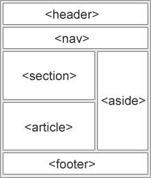

## ¿Qué son los Elementos Semánticos?

Un elemento semántico describe claramente su significado tanto para el navegador como para el desarrollador.

Ejemplos de elementos no semánticos: `
` y ``. No dicen nada sobre su contenido.

Ejemplos de elementos semánticos: `<form>`, `<table>`, y `<article>`. Definen claramente su contenido.

**Elementos Semánticos en HTML**

Muchos sitios web contienen código HTML como: `
 
 
` para indicar navegación, encabezado y pie de página.

En HTML hay algunos elementos semánticos que se pueden utilizar para definir diferentes partes de una página web:

1. **`<article>`**: El elemento especifica contenido independiente y autónomo.
   Un artículo debe tener sentido por sí solo, y debe ser posible distribuirlo independientemente del resto del sitio web. Puede ser utilizado en: Publicaciones del foro/blog, comentarios de los usuarios, tarjetas de productos, artículos de periódicos.

2. **`<aside>`**: Define algún contenido aparte del contenido que es colocado en (como una barra lateral). El contenido debe ser indirectamente relacionado con el contenido circundante.

3. **`
`**: Crea un widget desplegable que puede mostrar u ocultar contenido adicional. Se combina con `
` para proporcionar un título o encabezado que el usuario puede hacer clic para expandir o contraer el contenido.

4. **`
`**: Se usa para proporcionar un título o encabezado visible que describe el contenido de un `
` desplegable. Al hacer clic en `
`, se muestra u oculta el contenido dentro de `
`.

5. **`<figcaption>`**: La etiqueta define un título para un `<figure>`. El elemento `<figcaption>` se puede colocar como el primero o como el último hijo de un `<figure>`.

6. **`<figure>`**: Especifica el contenido autónomo, como ilustraciones, diagramas, fotos, listados de códigos, etc.

7. **`<footer>`**: Define un pie de página para un documento o sección. Contiene típicamente: Información de autoría, información de copyright, información de contacto, mapa del sitio, volver a los enlaces principales y documentos relacionados. Puede haber varios en un elemento.

8. **`<header>`**: Representa un contenedor para contenido introductorio o un conjunto de enlaces de navegación. Contiene típicamente: Uno o más elementos de encabezado (h1 - h6), logotipo o icono, información de autoría. Puedes tener varios elementos `<header>` en un documento HTML. Sin embargo, `<header>` no se puede colocar dentro de un `<footer>`, `<address>` u otro elemento `<header>`.

9. **`<main>`**: Representa el contenido principal de un documento, que es único y central para el propósito de la página, excluyendo encabezados, menús laterales y pie de página.

10. **`<mark>`**: Resalta texto dentro de un contenido, indicando que es relevante o importante, generalmente mostrándolo con un fondo de color resaltado.

11. **`<nav>`**: El elemento define un conjunto de enlaces de navegación. NO todos los enlaces de un documento deben estar dentro de un `<nav>`, este elemento está destinado solo a los principales bloques de enlaces de navegación.

12. **`<section>`**: Una sección es una agrupación temática de contenido, típicamente con un encabezado. Puede ser utilizado en: Capítulos, introducción, noticias, información de contacto.

13. **`<time>`**: Representa fechas y horas de forma semántica, permitiendo que tanto usuarios como sistemas entiendan claramente la información temporal.

