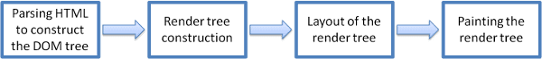
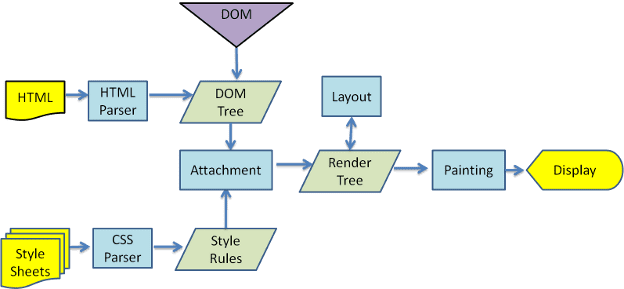

## Navegadores

Los navegadores web son el software más utilizado, la función principal de un navegador es presentar el recurso web que elijas solicitándolo al servidor y mostrándolo en la ventana del navegador. Por lo general, el recurso es un documento HTML, pero también puede ser un PDF, una imagen o algún otro tipo de contenido. El usuario especifica la ubicación del recurso mediante un URI (identificador uniforme de recursos).

Las interfaces de usuario de los navegadores tienen mucho en común. Entre los elementos comunes de la interfaz de usuario, se encuentran los siguientes:

1. Barra de direcciones para insertar un URI
2. Botones para retroceder y avanzar
3. Opciones para agregar a favoritos
4. Botones de actualización y detención para actualizar o detener la carga de documentos actuales
5. Botón de inicio que te lleva a la página principal
6. Curiosamente, la interfaz de usuario del navegador no está especificada en ninguna especificación formal, sino que proviene de buenas prácticas formadas a lo largo de años de experiencia y de que los navegadores se imitan entre sí.

Por supuesto, existen funciones exclusivas de un navegador específico, como el administrador de descargas de Firefox.

## Infraestructura de alto nivel

Los componentes principales del navegador son los siguientes:

1. **Interfaz de usuario:** Incluye la barra de direcciones, el botón Atrás/Adelante, el menú de favoritos, etc. Se muestran todas las partes del navegador, excepto la ventana donde ves la página solicitada.

2. **El motor del navegador:** Ordena las acciones entre la IU y el motor de renderización.

3. **El motor de renderización:** Es responsable de mostrar el contenido solicitado. Por ejemplo, si el contenido solicitado es HTML, el motor de renderización analiza HTML y CSS, y muestra el contenido analizado en la pantalla.

4. **Herramientas de redes:** Para llamadas de red, como solicitudes HTTP, mediante diferentes implementaciones para diferentes plataformas detrás de una interfaz independiente de la plataforma.

5. **Backend de la IU:** Se usa para dibujar widgets básicos, como ventanas y cuadros combinados. Este backend expone una interfaz genérica que no es específica de la plataforma. Debajo, se usan los métodos de la interfaz de usuario del sistema operativo.

6. **Intérprete de JavaScript:** Se usa para analizar y ejecutar código JavaScript.

7. **Almacenamiento de datos:** Esta es una capa de persistencia. Es posible que el navegador deba guardar todo tipo de datos de forma local, como las cookies. Los navegadores también admiten mecanismos de almacenamiento como localStorage, IndexedDB, WebSQL y FileSystem.

## Motores de renderización

El motor de renderización de un navegador es responsable de mostrar el contenido en pantalla, como imágenes y documentos HTML/XML. Puede usar complementos para manejar otros tipos de datos, como PDF. Los navegadores utilizan diferentes motores de renderización: Internet Explorer usa Trident, Firefox usa Gecko, Safari usa WebKit, y Chrome y Opera (desde la versión 15) usan Blink, una bifurcación de WebKit. WebKit, inicialmente para Linux, fue adaptado por Apple para Mac y Windows.

## El flujo principal

Este es el flujo básico del motor de renderización:

El motor de renderización comenzará a analizar el documento HTML y convertirá los elementos en nodos DOM en un árbol denominado "árbol de contenido". El motor analizará los datos de estilo, tanto en archivos CSS externos como en elementos de estilo. La información de estilo junto con las instrucciones visuales en el código HTML se usará para crear otro árbol: el árbol de renderización.

El árbol de renderización contiene rectángulos con atributos visuales, como el color y las dimensiones. Los rectángulos están en el orden correcto para que se muestren en la pantalla.

El motor de renderización procesa el HTML analizando el documento para crear un árbol DOM, que luego se convierte en un árbol de renderización con rectángulos que representan atributos visuales como color y dimensiones. El proceso de renderización incluye:

1. Construcción del árbol de contenido: Conversión de elementos HTML en nodos DOM.
2. Creación del árbol de renderización: Incorporación de datos de estilo para definir la disposición visual de los nodos.
3. Diseño: Determinación de las coordenadas exactas de cada nodo en la pantalla.
4. Painting (Pintado): Aplicación de la capa visual a cada nodo.
5. El motor de renderización intenta mostrar partes del contenido lo antes posible, en lugar de esperar a que todo el HTML se procese.

**Ejemplos de flujo principal**

