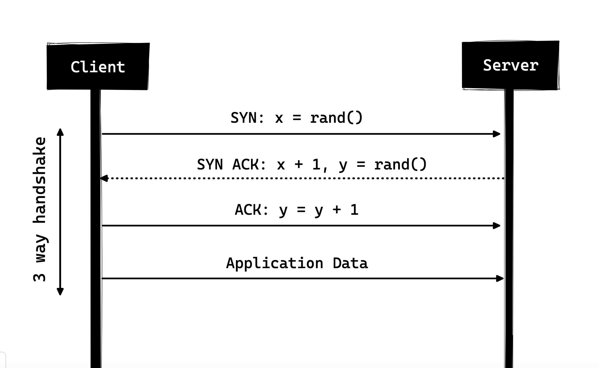

## ¿Que es HTTP?

HTTP es un protocolo de comunicación de capa de aplicación basado en TCP/IP que estandariza la forma en que los clientes y servidores se comunican entre sí.  en sí depende de TCP/IP para obtener solicitudes y respuestas entre el cliente y el servidor. De forma predeterminada, se usa el puerto TCP 80, pero también se pueden usar otros puertos. HTTPS, sin embargo, utiliza el puerto 443. 

## Metodos de solicitud:

1. **GET:** Recupera datos del servidor.
2. **POST:** Envía datos al servidor para crear o actualizar recursos.
3. **PUT:** Actualiza completamente un recurso en el servidor.
4. **DELETE:** Elimina un recurso en el servidor.
5. **HEAD:** Recupera los encabezados de una respuesta sin el cuerpo.
6. **OPTIONS:** Describe las opciones de comunicación para el recurso objetivo.
7. **PATCH:** Aplica modificaciones parciales a un recurso.

## Código de estado HTTP: 
Cada respuesta del servidor incluye un código de estado que indica el resultado de la solicitud. Algunos ejemplos comunes son:
1. **200 OK:** La solicitud ha sido exitosa.
2. **404 Not Found:** El recurso solicitado no se ha encontrado.
3. **500 Internal Server Error:** El servidor encontró un error inesperado.

## La primera versión documentada de HTTP fue HTTP/0,9

Se presentó en 1991. Era el protocolo más simple de la historia; tenía un solo método llamado **GET** y la respuesta tenia que ser HTML. 

En 1996, la próxima versión de HTTP i.e. **HTTP/1.0** evolucionó que mejoró enormemente con respecto a la versión original, ahora podría tratar con otros formatos de respuesta, es decir, imágenes, archivos de video, texto sin formato o cualquier otro tipo de contenido también. Agregó más métodos (es decir. POST y HEAD), se cambiaron los formatos de solicitud/respuesta, se agregaron encabezados HTTP tanto a la solicitud como a las respuestas, se agregaron códigos de estado para identificar la respuesta, se introdujo el soporte de conjunto de caracteres, se incluyeron tipos de múltiples partes, autorización, almacenamiento en caché, codificación de contenido y más.

**El Handshake de tres vías** en su forma simple es que todas las conexiones TCP comienzan con un handshake de tres vías en el que el cliente y el servidor comparten una serie de paquetes antes de comenzar a compartir los datos de la aplicación.

1. SYN - El cliente recoge un número aleatorio, deja decir x, y lo envía al servidor.
2. SYN ACK - El servidor reconoce la solicitud enviando un paquete ACK de vuelta al cliente que se compone de un número aleatorio, digamos y recogido por el servidor y el número x+1 donde x es el número que fue enviado por el cliente
3. ACK - El cliente incrementa el número y recibido del servidor y envía un paquete ACK de vuelta con el número y+1

Una vez que se completa el handshake de tres vías, puede comenzar el intercambio de datos entre el cliente y el servidor.

Además el servidor no mantiene la información sobre el cliente y por lo tanto cada una de las solicitudes tiene que tener la información necesaria para que el servidor cumpla con la solicitud en su propia sin ninguna asociación con ninguna solicitudes antiguas por lo que además de la gran cantidad de conexiones que tiene que abrir, tambien tiene que enviar algunos datos redundantes que causan mayor uso del ancho de banda.

## HTTP/1.1 - 1999

Las principales mejoras sobre HTTP/1.0 fueron:

1. Se agregaron nuevos métodos HTTP, que introdujeron PUT, PATCH, OPTIONS, DELETE
2. Identificación de nombre de host En HTTP/1.0 El encabezado del host no era necesario, pero HTTP/1.1 lo hacía necesario.
3. Conexiones persistentes Como se discutió anteriormente, en HTTP/1.0 solo había una solicitud por conexión y la conexión se cerraba tan pronto como se cumplia la solicitud, lo que resultó en problemas de rendimiento y latencia. HTTP/1.1 introdujo las conexiones persistentes, es decir, las conexiones no se cerraban de forma predeterminada y se mantenian abiertas, lo que permitia múltiples solicitudes secuenciales.
4. **Pipelining:** También introdujo el soporte para pipelining, donde el cliente podía enviar múltiples solicitudes al servidor sin esperar la respuesta del servidor en la misma conexión y el servidor tenía que enviar la respuesta en la misma secuencia en la que las solicitudes fueron recibidos
5. Transferencias fragmentadas En caso de contenido dinámico, cuando el servidor realmente no puede averiguar la longitud de contenido cuando se inicia la transmisión, puede comenzar a enviar el contenido en partes y agregar la longitud de contenido para cada fragmento cuando se envía. Y cuando se envían todos los trozos, se ha completado toda la transmisión, envía un fragmento vacío,  el que tiene Content-Length establecido en cero para identificar al cliente que la transmisión ha completado
6. A diferencia de HTTP/1.0 que solo tenía autenticación básica, HTTP/1.1 incluía autenticación de resumen y proxy.
7. Almacenamiento en caché
8. Rangos de Byte
9. Conjuntos de caracteres
10. Negociación lingüística
11. Cookies de cliente
12. Soporte de compresión mejorado
13. Nuevos códigos de estado

## SPDY - 2009

Google siguió adelante y comenzó a experimentar con protocolos alternativos para hacer la web más rápida y mejorar la seguridad web al tiempo que reduce la latencia de las páginas web. En 2009, anunciaron SPDY.
Se vio que si seguimos aumentando el ancho de banda(el ancho de banda es la cantidad de datos transferidos por segundo, bits por segundo), el rendimiento de la red aumenta al principio, pero llega un punto en el que no hay mucha ganancia de rendimiento. Pero si haces lo mismo con la latencia, es decir, si seguimos bajando la latencia, hay una ganancia de rendimiento constante. Esta fue la idea central para la ganancia de rendimiento detrás de SPDY, disminuir la latencia para aumentar el rendimiento de la red.

SPDY realmente intentó reemplazar HTTP; era una capa de traducción sobre HTTP que existía en la capa de aplicación y modificaba la solicitud antes de enviarla al cable. Comenzó a convertirse en un estándar de facto y la mayoría de los navegadores comenzaron a implementarlo.
En 2015, en Google, no querían tener dos estándares competitivos, por lo que decidieron fusionarlos en HTTP mientras daban a luz a HTTP/2 y depreciaban SPDY.

## HTTP/2 - 2015

HTTP/2 fue diseñado para el transporte de contenido de baja latencia.
Las características clave o las diferencias con respecto a la versión anterior de HTTP/1.1 incluyen: 

1. **Binario en lugar de Textual:**
HTTP/2 tiende a abordar el problema del aumento de la latencia que existía en HTTP/1.x al convertirlo en un protocolo binario. Al ser un protocolo binario, es más fácil de analizar, pero a diferencia de HTTP/1.x ya no es legible por el ojo humano. Los principales bloques de construcción de HTTP/2 son Frames y Streams.
Frames y Streams: os mensajes HTTP ahora están compuestos de una o más frames. 
Cada solicitud y respuesta HTTP/2 recibe un ID de flujo único y se divide en frames, Los frames no son más que piezas binarias de datos. Una colección de frames se llama Stream. 

2. **Multiplexación: múltiples solicitudes HTTP asíncronas a través de una sola conexión:**
una vez que se abre una conexión TCP, todas las transmisiones se envían de forma asíncrona a través de la misma conexión sin abrir ninguna conexión adicional. Y a su vez, el servidor responde de la misma manera asíncrona, la respuesta no tiene orden y el cliente utiliza el identificador de flujo asignado para identificar el flujo al que pertenece un paquete específico.

3. **Header compression con HPACK:**
HTTP/2 introduce la compresión de encabezados para optimizar el envío de datos redundantes y reducir el uso de ancho de banda y la latencia. En lugar de utilizar formatos como gzip, los encabezados se comprimen usando el código de Huffman y se mantiene una tabla de encabezados en el cliente y el servidor para referenciar encabezados repetitivos en solicitudes subsecuentes. Aunque los encabezados siguen siendo similares a HTTP/1.1, se añaden pseudoencabezados como :method, :scheme, :host and :path

4. **Server Push - Múltiples respuestas para una sola solicitud:**
Es otra característica tremenda de HTTP/2 donde el servidor, sabiendo que el cliente va a pedir un determinado recurso, puede empujarlo al cliente sin que ni siquiera el cliente lo solicite.

5. **Solicitud de Priorización:**
Un cliente puede asignar una prioridad a un flujo incluyendo la información de priorización en el marco HEADERS mediante el cual se abre un flujo. En cualquier otro momento, el cliente puede enviar un marco PRIORITY para cambiar la prioridad de un flujo. Sin ninguna información de prioridad, el servidor procesa las solicitudes de forma asíncrona, es decir, sin ningún orden. Si hay prioridad asignada a un flujo, entonces, en base a esta información de priorización, el servidor decide cuántos de los recursos se deben dar para procesar qué solicitud.

6. **Seguridad:**
Hubo una extensa discusión sobre si la seguridad (a través de TLS) debería ser obligatoria para HTTP/2 o no. Al final, se decidió no hacerlo obligatorio. Sin embargo, la mayoría de los proveedores declararon que solo admitirán HTTP/2 cuando se use sobre TLS. Entonces, aunque HTTP/2 no requiere cifrado por especificaciones, de todos modos se ha vuelto obligatorio por defecto.F 